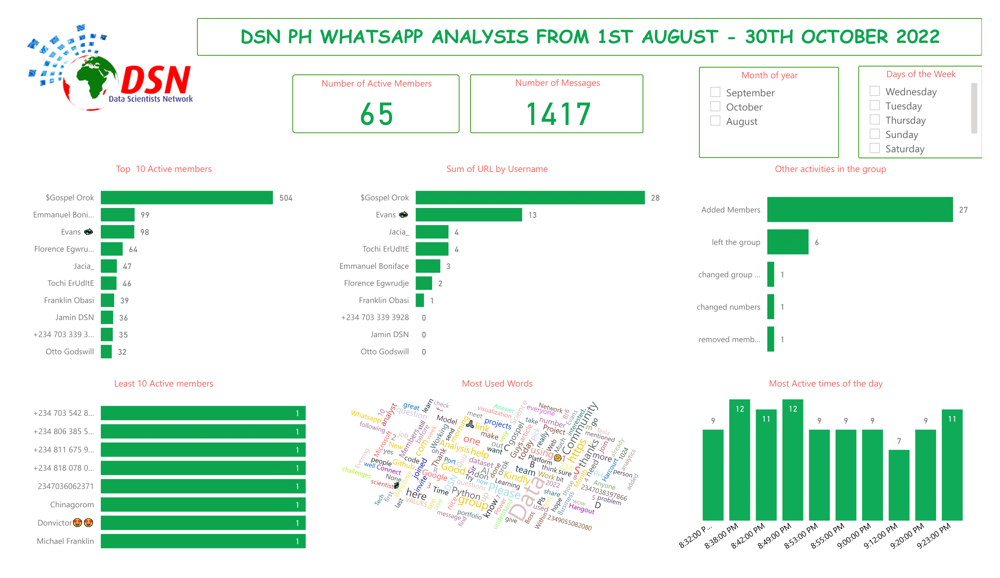

# DSN-Whatsapp-Chat-Analysis
This is a project to test my ability to work on .txt file documents

-----
## Project Description

It was the desire of the leaders of Data ScientistS Network, Port Harcourt City chapter to analyse her whatsapp group for the months of August to October 2022 and i voluntered to do this analysis. The reason being that I really wanted to work on ,txt file in order to be sure that i am skillfull to work with unstructured dataset.

## Problem
The project is designed to find answers to these questions.
Who are the most active persons in the group?
Who are the least active persons in the group?
What is the total number of contacts in the group?
What is the total number of messages in the group from August to October 2022?
To do this, a visualization of the monthly performance of the group will be needed as well as a visualization of the most used word by members of the group with a word cloud.

## Data Collection

This is quite interesting as WhatsApp stores data in a .txt file extension and this makes it a new thing for me. So let’s go to it. On the WhatsApp group, open it and click on the three dots at the topmost right-hand corner of the app, then click on more, click on export chat and finally choose without media.

## Data Preparation:

After exporting the chat as a txt file, there was a need to prepare the data and put into a structured form. Some people use power query, but I chose to use the basics of Python to get it done. A few codes were written as seen in the jupyter notebook attached in this repository.

## Data Cleaning:
The Excel file was opened and there was also a need to clean and properly format the sheet. The following steps were done in cleaning the file:

* Borders were put on the document
* Font style was changed to make all the same style and font
* The column name “Author” was changed to “Username”.
* Renumbering of the serial number was done.
* Separation of the “date” column into having days and months separately using the DAY and MONTH functions in Excel.
* Thereafter, I made some changes manually to the sheet as I really love to see sparkling clean data, in fact, I am obsessed with clean data.😂 The changes are noting and categorizing when members are added to the group, noting and categorizing when members left the group, noted those that changed numbers, noted those that were removed from the group. and finally noting when the group name was changed. The data was saved to be visualized using PowerBI.

## Data Analysis and Visualization:

The dataset was uploaded into PowerBI and on the Power query editor, I changed the “datetime” type to “date”, Afterwards, I viewed the column quality to check that there were no errors in the columns.

## Results:
* There are 65 active members in the group
* Gospel Orok, Emmanuel and Evans are the three most active members with Gospel having 36% of the overall messages.
* There are 8 people which were the least active in the group.
* The total number of messages in the group is 1417
* Gospel Orok also sent the highest number of URLs to the group.
* The time between 8:35 pm and 8:50 pm happens to be the most active time in the group
* 27 members were added to the group within the period of August to October 2022.
* 6 people left the group, 1 person changed phone number and the group name was changed once.
* October had more chats/activities than August and September.
* Saturday is the day with the highest activities with 473 chats and 35 active persons accounting for 33% of total chats.
* “DATA” is the most used word in the group.

## Limitation:
I was supposed to carry out sensitivity analysis, I believe it is possible with PowerBI as it was possible to use Word Cloud in PowerBI by using the Word Cloud extension, but for some reason, I wouldn't want to cloud the dashboard so I will skip it and perhaps use Python next time for the full analysis.

## The End.
